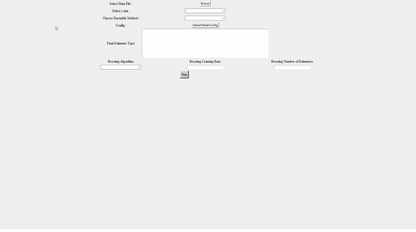
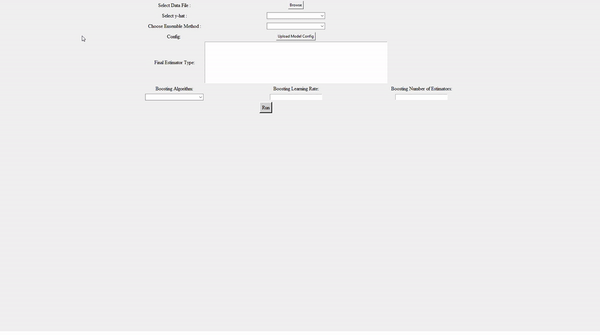
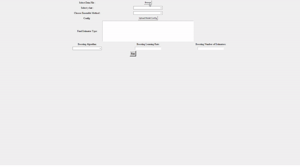

# IOT-ensemble-trainer

### Overview
The IOT-ensemble-trainer is an ensemble model training tool, that allows users to train various ensemble models with varying architectures, all via a python [tkinter](https://docs.python.org/3/library/tkinter.html) user interface. It was aimed at assisting with the training of models on IOT (Internet Of Things) datasets where each entry is an independent 1D array containing several features and a classification (y-hat). The trainer also has an inbuilt neural network verification functionality that is implemented using [Sapphire](https://github.com/wenkokke/sapphire/tree/master). The neural network verification will work on any MLP that is added to the base models when using a bagging ensemble method. 

### Setup/Installation 
1) Clone the repo: 
```
git clone https://github.com/BigJonP/IOT-ensemble-trainer.git
```

2) Create a virtual environment (example for Linux, please do the equivalent for the OS you are using to run the trainer): 
```
cd IOT-ensemble-trainer
python3.9 -m venv venv
source venv/bin/activate
```
<i>The trainer currently only supports python version 3.9</i><br>

3) Clone Sapphire:
```
git clone https://github.com/wenkokke/sapphire.git
```
4) Install trainer and sapphire requirements:
```
pip install -r requirements.txt
cd sapphire
pip install -r requirements.txt
cd ..
```
5) Launch the trainer:
```
python3.9 main.py
```

### Usage

To use the IOT-ensemble-trainer, you will need 2 files, or 3 if you also wish to conduct neural network verification. The files required are as follows:
- Dataset file (.csv)
- Model configuration file (.json)
- Optional bounds/verification file used to verify neural networks
<br>

Check out the [configuration documentation](config_files.md) to see the model and configurations supported by the IOT-ensemble-trainer.

#### Loading data and choosing ensemble method
When running the trainer, you can begin by selecting the data file you wish to use (you can use `sample_data.csv` located in the [samples folder](samples)). Once you select the file, the trainer will parse the data and provide you with a list of columns. You can browse this list via the dropdown in the y-hat entry, then simply select the column that should act as y-hat (the prediction label). Then you can select an ensemble method ("Bagging", "Stacking" or "Adaboosting"), please note that different ensemble methods require different components and so the usage of the trainer from this point onwards will vary slightly depending on the ensemble method chosen.

#### Model configurations
To upload the base models configuration simple click the `Upload Model Config` button and select your model configuration file, please check out the [model configuration documentation](config_files.md) to make sure your base models are supported. Also, please note that if any of the data provided in the data file is incompatible with one of the base models, as expected the trainer will fail to train this model. 

The `Final Estimator Type` text entry field is only relevant for a stacking ensemble method. It follows the same logic as the model config file, so for instance the following:

```
{
    "type": "LogisticRegression",
    "params": {
        "tol": 0.001,
        "C": 2.0,
        "max_iter": 250,
    },
}
```
Would use a Logistic Regression with a `tol` of `0.001`, `C` of `2.0` and a `max_iter` of `250`.

The `Boosting Algorithm`, `Boosting Learning Rate` and `Boosting Number of Estimators` are all only relevant for when the ensemble method is `Adaboosting` and these dropdowns will modify the parameters used for the Ada Boost trainer. Please note that the model config and final estimator fields will be ignored and only these three boosting fields will be used when using `Adaboosting` as the ensemble method.

#### Run
Once all the configurations have been specified, click on `Run` and the model will begin training. Once training is complete, the model will be tested on the testing data (automatically parsed as 20% of the data provided), and the accuracy will be displayed to the screen. In case where one or more of the base models was an MLP, a `Verify MLPs` option will appear allowing you the user to implement a formal verification method (Satisfiability Modulo Linear Arithmetic Solver), using a ["bounds/verification"](config_files.md) file containing specifications for verification.


### Example simple bagging (no neural networks and no verification)


### Example bagging with neural networks and verification


### Example stacking


### Example boosting
